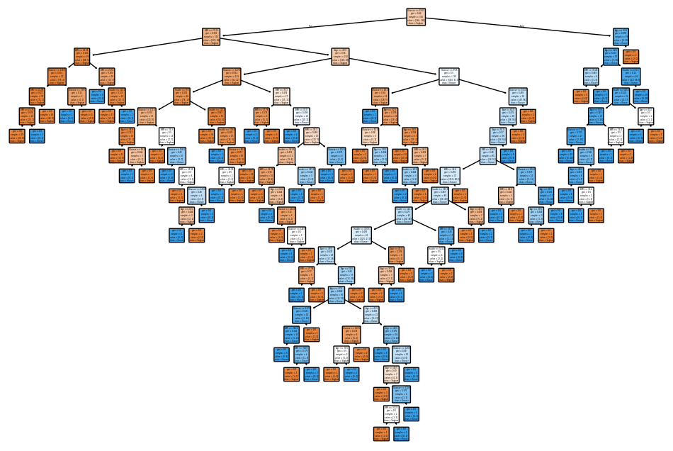
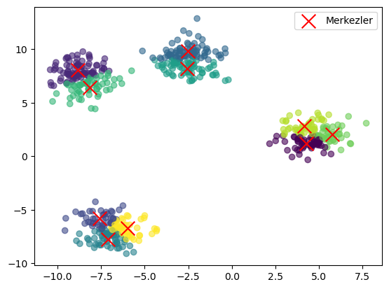

# Diyabet Tahmini & KMeans Kümeleme Projeleri

## 1. Diyabet Tahmini – Karar Ağacı Sınıflandırıcı

Bu proje, seçilen medikal özelliklere dayanarak diyabeti tahmin etmek için **Decision Tree Classifier** kullanır.

### Veri Seti
- **Dosya:** `diabetes.csv`  
- **Özellikler:** `Glucose`, `Insulin`, `BMI`, `Age`  
- **Hedef:** `Outcome` (0 = Sağlam, 1 = Diyabetli)

### Adımlar

#### 1. Veri Ön İşleme
- Kategorik değerler (`Yes`/`No`) sayısal değerlere (1/0) dönüştürülür.  
- Seçilen özellikler: `Glucose`, `Insulin`, `BMI`, `Age`  
- Hedef değişken: `Outcome`

#### 2. Eğitim ve Test Verisinin Ayrılması
- Veri seti %50 eğitim ve %50 test olarak ayrılır (`train_test_split`, `random_state=42`)

#### 3. Model Eğitimi
- Decision Tree Classifier, `max_depth=100` parametresi ile oluşturulur  
- Model eğitim verisi üzerinde eğitilir

#### 4. Görselleştirme
- Karar ağacı `matplotlib` ile çizilir  
- Düğümler özellik ve sınıf isimleri ile etiketlenir:
  - `0`: Sağlam (Healthy)  
  - `1`: Diyabetli (Diabetic)

#### 5. Değerlendirme
- **Doğruluk (Accuracy):** %71  
- **Karışıklık Matrisi (Confusion Matrix):**
- [[197 54]
[ 57 76]]
- **F1 Skoru:** 0.578  
- **Classification Report:** Her sınıf için precision, recall ve F1 skoru

> **Not:** Model sağlıklı hastaları tahmin etmede oldukça başarılı, ancak diyabetli hastalarda performansı daha düşük. Özellik seçimi ve hiperparametre optimizasyonu ile model performansı artırılabilir.

---

## 2. KMeans Kümeleme Örneği

Bu proje, KMeans algoritmasını kullanarak rastgele oluşturulmuş veri kümelerini analiz etmeyi ve görselleştirmeyi amaçlamaktadır.

### Adımlar

#### 1. Veri Oluşturma
- `make_blobs` fonksiyonu ile 4 merkezli, 560 örnekten oluşan rastgele veri kümesi oluşturulur  
- `x`: Özellikler, `y`: Gerçek etiketler

#### 2. KMeans Modeli
- `n_clusters=10` ile KMeans tanımlanır  
- Model veri üzerinde fit edilir ve her veri noktası bir kümeye atanır (`labels`)

#### 3. Küme Merkezleri
- `cluster_centers_` ile bulunur ve görselleştirmede kırmızı X ile gösterilir

#### 4. Görselleştirme
- `matplotlib` ile veri noktaları ve kümeleri renklerle gösterilir  
- Küme merkezleri vurgulanır ve legend ile açıklanır.

 

---

## 3. Diyabet Tahmini – Karar Ağacı + Hiperparametre Optimizasyonu

Bu proje, **Decision Tree Classifier** kullanılarak diyabet tahmini yapılmasını ve model performansını artırmak için **hiperparametre optimizasyonunu** içerir.

### Ek Adımlar

#### 1. Çapraz Doğrulama (Cross-Validation)
- 3 katlı çapraz doğrulama ile modelin genel doğruluğu ölçülür

#### 2. Hiperparametre Optimizasyonu (GridSearchCV)
- `max_depth` için değerler denenir: `[3, 5, 7, None, 15]`  
- 5 katlı çapraz doğrulama ile en iyi hiperparametre seçilir  
- En iyi parametre ile model tekrar test edilir ve performans raporlanır

---

## Kullanılan Teknolojiler
- Python 3.x  
- pandas, numpy  
- scikit-learn  
- matplotlib, seaborn

